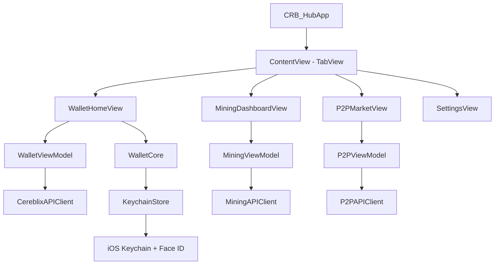

# CRB Hub — Cereblix (CRB) iOS Wallet

🇻🇳 [Tiếng Việt](#tiếng-việt) | 🇺🇸 [English](#english)

---

## English

[]()
[]()
[](LICENSE)

**CRB Hub** is a premium native iOS non-custodial wallet built using SwiftUI for the Cereblix (CRB) blockchain. The application delivers robust local key management, mining dashboard statistics, P2P exchange trading, and multi-language support (11 languages) with local fiat currency conversion.

### 👤 Project Owner & Developer Support
This project is owned and maintained by **Hoang Tuan Nguyen**. If you find this app helpful, please consider supporting the project to fund further development!

* **Donation Address (Cereblix)**: `crb1bcf10b1d12f028f8a3583010c1be8f228360727b`
* **Direct Donation**: You can donate directly inside the app's Settings menu.

> [!IMPORTANT]
> **Cereblix Native & Secured**: This app runs **100% on the Cereblix network**. All private-key access is protected through iOS Keychain access control (`kSecAttrAccessibleWhenPasscodeSetThisDeviceOnly` + current biometric set) and sensitive wallet actions require Face ID / Touch ID with password fallback. Your private keys never leave your device.

### 🌟 Key Features
* **Non-Custodial Wallet Management**: Generate a random ed25519 keypair or import via a 64-character hex private key. Securely encrypted and stored locally in the iOS Keychain.
* **Biometric Verification**: Verify sensitive actions (key export, trade actions) using Face ID / Touch ID.
* **Mining Monitor**: Track personal hashrates, worker statuses (Active/Idle), and Pool stats (Pool hashrate, active miners, blocks, pool fees, minimum payout). Includes a one-tap run command copy helper.
* **P2P OTC Market & Trading**: Decentralized P2P login using ed25519 wallet signatures. View real-time order books, tickers, and recent trades. Manage complete trade lifecycles (Lock, Complete, Cancel, Appeal) with encrypted chat, block list controls, and feedback.
* **USDT Wallet & SafeTrade Integration**: Link SafeTrade API credentials, sync supported USDT deposit wallets, choose default P2P receiving wallets per rail, view balances, and prepare protected USDT transfers for P2P escrow workflows.
* **Production Transaction Protection**: CRB sends and USDT transfer flows require biometric authentication first, with password fallback for wallet unlock recovery.
* **Localization & Fiat Conversion**: Supports 11 languages out-of-the-box (English, Vietnamese, Russian, Chinese, Korean, Japanese, Thai, Indonesian, Spanish, French, German). Converts CRB values to local fiat currencies dynamically (USD, VND, EUR, CNY, JPY, KRW, THB, IDR, RUB, GBP) with offline caching.
* **Decimal-Safe Money Handling**: CRB/USDT prices, fiat rates, balances, and P2P amounts are handled with `Decimal` or integer base units to preserve small values such as `0.000x`.

### Recent Production Hardening
* Upgraded Keychain private-key storage to passcode-required, this-device-only, biometric-current-set access control.
* Added wallet password fallback and secure unlock paths for CRB sends, P2P login signing, and USDT transfer attempts.
* Implemented real CRB transaction signing and broadcast payloads aligned with Cereblix transaction formats.
* Hardened P2P login signing against replay by validating the canonical OTC challenge before signing.
* Linked USDT wallets directly into P2P offer creation, take-offer flows, trade detail, and persisted wallet bindings.
* Added SafeTrade API settings, connection test, USDT deposit wallet sync, spot balance retrieval, and withdraw request plumbing.
* Restricted P2P USDT rails to the project-supported networks and validates receiving addresses before create/take actions.
* Replaced floating-point money paths with `Decimal` caches, formatting, conversion, and token-balance parsing.
* Hardened custom node URLs, URL query construction, clipboard handling, app background privacy, app version display, and Settings scrolling behavior.

### 🛠️ Architecture & Tech Stack
* **UI**: SwiftUI (iOS 18.0+)
* **Crypto**: Apple CryptoKit (ed25519 signatures)
* **Storage**: iOS Keychain Services (`kSecAttrAccessibleWhenPasscodeSetThisDeviceOnly`, biometric access control) & UserDefaults
* **State Management**: `@Observable` architecture with view models refreshing dynamically



### 🌍 Supported Languages
* `en` (English) - USD (United States Dollar)
* `vi` (Tiếng Việt) - VND (Vietnamese Dong)
* `ru` (Русский) - RUB (Russian Ruble)
* `zh-Hans` (简体中文) - CNY (Chinese Yuan)
* `ko` (한국어) - KRW (Korean Won)
* `ja` (日本語) - JPY (Japanese Yen)
* `th` (ไทย) - THB (Thai Baht)
* `id` (Bahasa Indonesia) - IDR (Indonesian Rupiah)
* `es` (Español) - EUR / USD (Euro / Dollar)
* `fr` (Français) - EUR (Euro)
* `de` (Deutsch) - EUR (Euro)

### 🚀 Getting Started
1. Clone the repository:
   ```bash
   git clone https://github.com/[username]/CRBHub.git
   cd CRBHub
   ```
2. Open the Xcode workspace:
   ```bash
   open "CRB Hub/CRB Hub.xcodeproj"
   ```
3. Set your **Signing & Capabilities** team under project settings.
4. Run the project (`Cmd + R`) on an iOS 18.0+ Simulator or real device.

### 📦 App Store Submission Readiness
* **Privacy Description**: `NSFaceIDUsageDescription` is preconfigured in `Info.plist` to explain how Face ID protects keys locally.
* **Export Compliance**: Uses Apple's standard CryptoKit. When submitting to App Store Connect, select **Yes** for the export compliance exemption as it utilizes standard built-in operating system encryption.
* **Age Rating**: Due to real-time P2P exchange and financial transaction capabilities, age rating should be configured as **17+**.

---

## Tiếng Việt

[]()
[]()
[](LICENSE)

**CRB Hub** là ứng dụng ví phi lưu ký (non-custodial wallet) chạy native trên hệ điều hành iOS dành cho mạng lưới Cereblix (CRB). Ứng dụng cung cấp các tính năng quản lý tài sản bảo mật cao, theo dõi khai thác (mining monitoring), trao đổi giao dịch P2P OTC và tích hợp đa ngôn ngữ toàn diện.

### 👤 Chủ Sở Hữu & Ủng Hộ Phát Triển
Dự án được sở hữu và phát triển bởi **Hoang Tuan Nguyen**. Mọi sự ủng hộ (donate) từ cộng đồng sẽ là nguồn động lực to lớn để tiếp tục nâng cấp và phát triển ứng dụng trong tương lai!

* **Địa chỉ ví nhận ủng hộ (Cereblix)**: `crb1bcf10b1d12f028f8a3583010c1be8f228360727b`
* **Gửi trực tiếp**: Bạn có thể thực hiện gửi tiền ủng hộ trực tiếp trong phần Cài đặt (Settings) của ứng dụng.

> [!IMPORTANT]
> **Hoạt động 100% trên Cereblix**: Dự án được xây dựng và chạy **100% trực tiếp trên mạng lưới Cereblix**. Mọi đường đọc khóa bí mật đều đi qua Keychain access control (`kSecAttrAccessibleWhenPasscodeSetThisDeviceOnly` + bộ sinh trắc học hiện tại), kết hợp Face ID / Touch ID và cơ chế nhập mật khẩu dự phòng. Khóa bí mật của bạn không bao giờ rời khỏi thiết bị.

### 🌟 Tính Năng Chính
* **Quản Lý Ví Bảo Mật**: Tạo ví mới (sinh cặp khóa ed25519 ngẫu nhiên) hoặc nhập ví cũ (qua khóa bí mật Hex 64 ký tự). Khóa được mã hóa và lưu trữ an toàn cục bộ trong iOS Keychain.
* **Bảo Vệ Sinh Trắc Học**: Xác thực Face ID / Touch ID để phê duyệt giao dịch và xuất khóa bảo mật.
* **Theo Dõi Khai Thác**: Hiển thị hashrate cá nhân, hashrate pool, thợ đào đang hoạt động, khối tìm thấy, phí pool và hạn mức thanh toán. Hỗ trợ sao chép lệnh chạy miner chỉ với 1 lượt chạm.
* **Thị Trường P2P OTC**: Đăng nhập P2P không mật khẩu sử dụng chữ ký số ed25519. Xem sổ lệnh, ticker và lịch sử giao dịch. Quản lý trạng thái giao dịch (Khóa quỹ, Hoàn thành, Hủy, Khiếu nại) đi kèm phòng chat trực tiếp mã hóa, chặn người dùng và đánh giá tín nhiệm.
* **Ví USDT & SafeTrade**: Liên kết API SafeTrade, đồng bộ ví nhận USDT theo mạng được hỗ trợ, chọn ví mặc định cho P2P, xem số dư và chuẩn bị luồng chuyển USDT có xác thực.
* **Bảo Vệ Giao Dịch Production**: Chuyển CRB và các luồng chuyển USDT yêu cầu Face ID / Touch ID trước, nếu thất bại có thể mở khóa bằng mật khẩu ví.
* **Đa Ngôn Ngữ & Quy Đổi Ngoại Tệ**: Hỗ trợ tự động 11 ngôn ngữ phổ biến nhất dựa trên ngôn ngữ thiết bị. Quy đổi số dư CRB sang tỷ giá fiat nội địa tương ứng với vùng (Region) của điện thoại (VND, USD, EUR, CNY, JPY, KRW, THB, IDR, RUB, GBP) với cơ chế lưu đệm offline.
* **Tính Toán Tiền Bằng Decimal**: Giá CRB/USDT, tỷ giá fiat, số dư và khối lượng P2P dùng `Decimal` hoặc đơn vị gốc để giữ chính xác các giá trị rất nhỏ như `0.000x`.

### Nâng Cấp Production Gần Đây
* Nâng bảo vệ Keychain lên passcode-required, this-device-only và biometric-current-set.
* Thêm mật khẩu ví dự phòng cho các luồng mở khóa khi Face ID / Touch ID thất bại.
* Kích hoạt ký và broadcast giao dịch CRB thật theo định dạng giao dịch Cereblix.
* Siết P2P login signing bằng cách xác thực challenge OTC chuẩn trước khi ký.
* Liên kết ví USDT trực tiếp vào create offer, take offer, trade detail và lưu binding theo giao dịch.
* Thêm cài đặt SafeTrade API, test kết nối, đồng bộ ví nạp USDT, xem số dư spot và plumbing withdraw.
* Giới hạn rail USDT cho P2P theo mạng dự án hỗ trợ và validate địa chỉ trước khi tạo/take lệnh.
* Chuyển các đường tiền khỏi `Double`, dùng `Decimal` cho cache giá, tỷ giá, formatter, balance và P2P amount.
* Hardening custom node URL, URL query, clipboard, che app khi background, hiển thị version và khóa scroll ngang ở Settings.

### 🛠️ Công Nghệ & Kiến Trúc
* **Giao Diện**: SwiftUI (iOS 18.0+)
* **Mã Hóa**: Apple CryptoKit (chữ ký số ed25519)
* **Lưu Trữ**: Keychain Services (`kSecAttrAccessibleWhenPasscodeSetThisDeviceOnly`, biometric access control) & UserDefaults
* **Quản Lý Trạng Thái**: Kiến trúc `@Observable` với các View Models cập nhật thời gian thực

### 🌍 Ngôn Ngữ Hỗ Trợ
* `en` (English) - USD (Đô la Mỹ)
* `vi` (Tiếng Việt) - VND (Đồng Việt Nam)
* `ru` (Русский) - RUB (Rúp Nga)
* `zh-Hans` (简体中文) - CNY (Nhân dân tệ)
* `ko` (한국어) - KRW (Won Hàn Quốc)
* `ja` (日本語) - JPY (Yên Nhật)
* `th` (ไทย) - THB (Baht Thái)
* `id` (Bahasa Indonesia) - IDR (Rupiah Indonesia)
* `es` (Español) - EUR / USD (Euro / Đô la)
* `fr` (Français) - EUR (Euro)
* `de` (Deutsch) - EUR (Euro)

### 🚀 Hướng Dẫn Cài Đặt & Chạy Dự Án
1. Clone mã nguồn:
   ```bash
   git clone https://github.com/hoangftuans/CRB-HUB
   cd CRBHub
   ```
2. Mở dự án trong Xcode:
   ```bash
   open "CRB Hub/CRB Hub.xcodeproj"
   ```
3. Thiết lập mục **Signing & Capabilities** bằng tài khoản Developer cá nhân hoặc doanh nghiệp.
4. Nhấn `Cmd + R` để khởi chạy ứng dụng trên Simulator hoặc thiết bị chạy iOS 18.0+.

### 📦 Kế Hoạch Đưa Lên App Store
* **Quyền Riêng Tư**: Quyền Face ID `NSFaceIDUsageDescription` đã cấu hình sẵn trong `Info.plist` giải thích cách Face ID bảo vệ khóa ví cục bộ.
* **Chứng Chỉ Mã Hóa**: Ứng dụng sử dụng CryptoKit gốc của hệ điều hành. Khi gửi bản build lên App Store Connect, hãy chọn **Yes** cho mục miễn trừ chứng nhận xuất khẩu mật mã (Export Compliance Exemption).
* **Độ Tuổi**: Đánh giá độ tuổi nên được chọn ở mức **17+** do tính năng quản lý tài chính và giao dịch P2P tiền điện tử.

---

## 📄 License

This project is licensed under the terms of the **MIT License**. See [LICENSE](LICENSE) for details.
Dự án được cấp phép hoạt động theo các điều khoản của **MIT License**. Xem file [LICENSE](LICENSE) để biết thêm chi tiết.
