# CRB Hub — Cereblix (CRB) iOS Wallet

[]()
[]()
[](LICENSE)

**CRB Hub** là ứng dụng ví phi lưu ký (non-custodial wallet) chạy native trên hệ điều hành iOS dành cho mạng lưới Cereblix (CRB). Ứng dụng cung cấp các tính năng quản lý tài sản bảo mật cao, theo dõi khai thác (mining monitoring), trao đổi giao dịch P2P OTC và tích hợp đa ngôn ngữ toàn diện.

---

## 🌟 Tính Năng Chính

### 1. Quản Lý Ví Bảo Mật (Non-Custodial)
* **Tạo ví mới**: Sinh cặp khóa ed25519 ngẫu nhiên, mã hóa khóa bí mật lưu trữ an toàn trong iOS Keychain.
* **Nhập ví hiện có**: Nhập khóa từ chuỗi Hex 64 ký tự với cơ chế kiểm tra lỗi thời gian thực.
* **Bảo vệ sinh trắc học**: Xác thực Face ID / Touch ID cho các thao tác nhạy cảm (xuất khóa, phê duyệt giao dịch).
* **Số dư & Lịch sử**: Hiển thị số dư khả dụng, đã đào, đã nhận, đã gửi và danh sách giao dịch không giới hạn.

### 2. Trình Theo Dõi Khai Thác (Mining Monitor)
* Theo dõi các chỉ số Hashrate cá nhân và Pool Stats (Thợ đào hoạt động, Máy đào, Số khối tìm được, Phí Pool).
* Thống kê chi tiết thu nhập: Số dư chưa thanh toán (Owed), Đã thanh toán (Paid), Tổng thu nhập (Earned).
* Trình hướng dẫn cấu hình: Chọn vùng kết nối và sao chép lệnh chạy miner chỉ với 1 lượt chạm.

### 3. Sàn Giao Dịch P2P OTC
* **Thị trường công khai**: Bảng giá Ticker thời gian thực, Sổ lệnh (Buy/Sell Order Book) và các giao dịch gần đây.
* **Đăng nhập phi tập trung**: Sử dụng chữ ký số ed25519 từ ví để đăng nhập hệ thống P2P OTC không cần mật khẩu.
* **Quy trình giao dịch hoàn chỉnh**: Tạo lệnh quảng cáo, nhận lệnh, quản lý tiến trình giao dịch (Lock, Complete, Cancel, Appeal), chat trực tiếp mã hóa trong phòng giao dịch, phản hồi đánh giá và chặn người dùng.

### 4. Đa Ngôn Ngữ & Quy Đổi Ngoại Tệ
* **Hỗ trợ 11 ngôn ngữ**: Tự động phát hiện ngôn ngữ hệ thống của iOS hoặc tự động chuyển hướng về tiếng Anh nếu không hỗ trợ.
* **Quy đổi tiền tệ địa phương**: Quy đổi số dư từ CRB sang USD/USDT dựa trên tỷ giá P2P, sau đó tự động quy đổi sang loại tiền tệ tương ứng theo khu vực hệ thống (Region) của thiết bị (hỗ trợ VND, USD, EUR, CNY, JPY, KRW, THB, IDR, RUB, GBP).
* **Chế độ ngoại tuyến (Offline)**: Tự động lưu trữ tỷ giá trong bộ nhớ tạm (UserDefaults) để hiển thị khi thiết bị mất kết nối.

---

## 🛠️ Công Nghệ & Kiến Trúc

* **UI Framework**: SwiftUI (iOS 18.0+)
* **Cryptography**: Apple CryptoKit (ed25519 signature & verification)
* **Storage**: iOS Keychain Services (`kSecAttrAccessibleWhenUnlockedThisDeviceOnly`) & UserDefaults
* **State Management**: SwiftUI `@Observable` Architecture

### Sơ đồ kiến trúc luồng dữ liệu:

```mermaid
graph TD
    A[CRB_HubApp] --> B[ContentView - TabView]
    B --> C[WalletHomeView]
    B --> D[MiningDashboardView]
    B --> E[P2PMarketView]
    B --> F[SettingsView]
    
    C --> G[WalletViewModel]
    D --> H[MiningViewModel]
    E --> I[P2PViewModel]
    
    G --> J[CereblixAPIClient]
    H --> K[MiningAPIClient]
    I --> L[P2PAPIClient]
    
    C --> N[WalletCore]
    N --> O[KeychainStore]
    O --> P[iOS Keychain + Face ID]
```



---

## 🌍 Ngôn Ngữ Hỗ Trợ

| Mã Ngôn Ngữ | Tên Ngôn Ngữ | Quốc Gia / Vùng Mặc Định | Đồng Tiền Quy Đổi |
|-------------|--------------|--------------------------|-------------------|
| `en` | English | United States / Global | USD |
| `vi` | Tiếng Việt | Vietnam | VND |
| `ru` | Русский | Russia | RUB |
| `zh-Hans` | 简体中文 | China | CNY |
| `ko` | 한국어 | South Korea | KRW |
| `ja` | 日本語 | Japan | JPY |
| `th` | ไทย | Thailand | THB |
| `id` | Bahasa Indonesia | Indonesia | IDR |
| `es` | Español | Spain / LatAm | EUR / USD |
| `fr` | Français | France | EUR |
| `de` | Deutsch | Germany | EUR |

---

## 🚀 Hướng Dẫn Cài Đặt & Chạy Dự Án

### Yêu cầu hệ thống:
* macOS Sequoia hoặc cao hơn.
* Xcode 16.0 hoặc cao hơn.
* Thiết bị iOS 18.0+ hoặc Simulator tương ứng.

### Các bước thực hiện:
1. Clone mã nguồn về máy:
   ```bash
   git clone https://github.com/[username]/CRBHub.git
   cd CRBHub
   ```
2. Mở file dự án bằng Xcode:
   ```bash
   open "CRB Hub/CRB Hub.xcodeproj"
   ```
3. Chọn Thiết bị chạy (iPhone Simulator hoặc Thiết bị thật của bạn).
4. Thiết lập **Signing & Capabilities** bằng cách chọn tài khoản Developer của bạn.
5. Nhấn `Cmd + R` để biên dịch và chạy ứng dụng.

---

## 📦 Kế Hoạch Đưa Lên App Store (App Store Submission Readiness)

Trước khi gửi bản build lên App Store Connect, hãy chuẩn bị các tài liệu và kiểm tra danh sách sau:

### 1. Mô tả quyền sử dụng Face ID (Quyền riêng tư)
Trong dự án, khóa mô tả quyền truy cập Face ID đã được tích hợp trong file `Info.plist`:
```xml
<key>NSFaceIDUsageDescription</key>
<string>CRB Hub uses Face ID to protect your wallet private keys and authorize transactions.</string>
```
Khi điền thông tin mô tả ứng dụng trên App Store Connect, bạn phải giải thích rõ ràng tại sao ứng dụng cần quyền sử dụng Face ID (bảo vệ khóa bảo mật cục bộ của ví).

### 2. Thông tin mã hóa sản phẩm (Export Compliance)
Ứng dụng sử dụng mã hóa ed25519 (thuộc Apple CryptoKit) để đăng nhập và ký các giao dịch P2P cục bộ. Đây là dạng mã hóa chuẩn công nghiệp và được miễn trừ đăng ký xuất khẩu mã hóa (Export Compliance) tại Mỹ theo luật ERN nếu ứng dụng chỉ sử dụng các hàm mã hóa chuẩn của hệ điều hành. Khi tải lên App Store Connect, hãy chọn **Yes** cho mục *"Is your app eligible for the export compliance exemption?"*.

### 3. Đánh giá độ tuổi (Age Rating)
Vì ứng dụng có tính năng sàn giao dịch P2P (OTC) tiền mã hóa và quản lý ví tài chính, hãy đánh giá độ tuổi ứng dụng ở mức **17+** hoặc theo các tiêu chuẩn phân loại sản phẩm tài chính/tiền điện tử của App Store.

---

## 📄 Giấy Phép (License)

Dự án này được cấp phép theo các điều khoản của **MIT License**. Chi tiết xem tại file [LICENSE](LICENSE).
